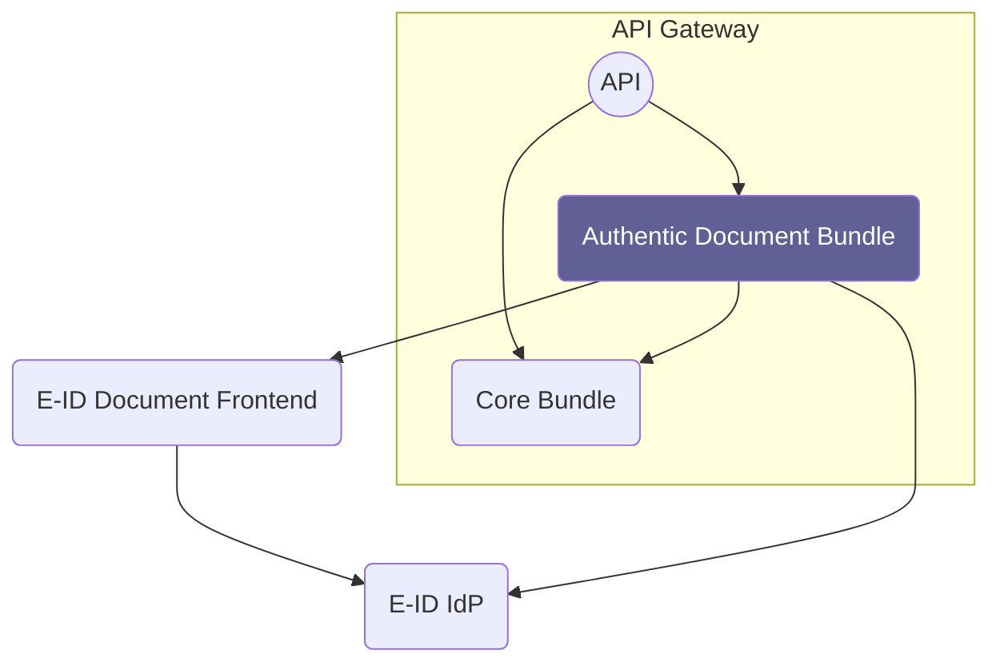

# Overview

Source: https://github.com/digital-blueprint/relay-authentic-documents-bundle

### E-ID IdP

The E-ID Identity Provider

### E-ID Document Frontend

The E-ID Document Frontend by [EGIZ](https://www.egiz.gv.at/en/) is accessed to
request and receive authentic documents from the government.
